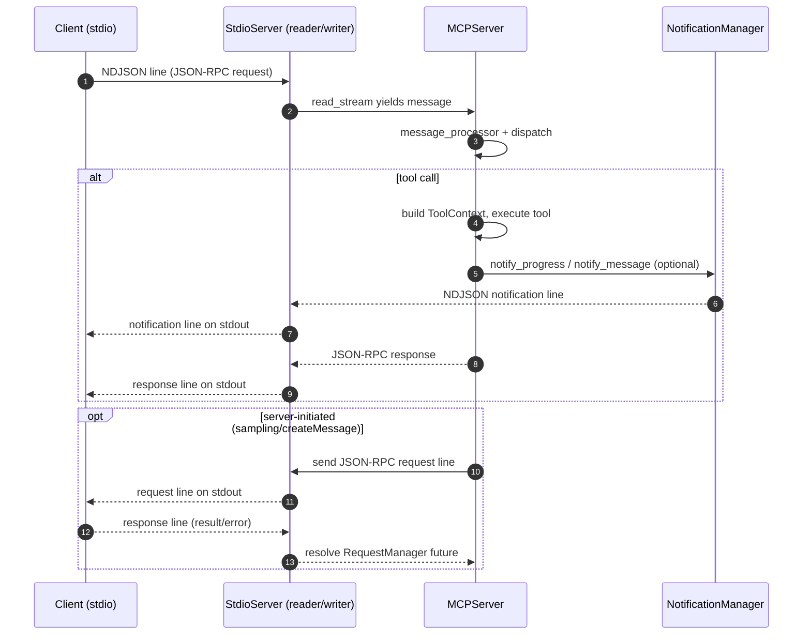

## Arcade MCP Server Design (Spec 2025-06-18)

### Overview
- Implements MCP per 2025-06-18 spec with unified transport-agnostic handling.
- First-class DX via `@tool` + `ToolContext` (logging, progress, auth, client APIs).
- Optional resumability for HTTP transports via EventStore, SSE event ids, and Last-Event-ID.

### Lifecycle
- MCPServer.start()/stop() manage NotificationManager once per process.
- FastAPI StreamableHTTPComponent calls start/stop in app lifespan.
- StdioServer calls start/stop around the run loop.
- Per-session: RequestManager is created on connection; ToolContext per tool call.

### Quick Start
- Minimal: `server = Server(...); server.add_tool(...); server.run(transport="streamable-http"|"sse"|"stdio")`
- Custom FastAPI: create `app = FastAPI()`; set `server.app = app`; run with uvicorn.

---

## Spec Coverage Summary

### Core JSON-RPC
- JSONRPC_VERSION: 2.0
- LATEST_PROTOCOL_VERSION: 2025-06-18
- Types: JSONRPCRequest, JSONRPCResponse, JSONRPCError, Result

### Initialization
- initialize (request/response): protocolVersion, ClientCapabilities, ServerCapabilities, Implementation, optional instructions
- notifications/initialized (notification)

### Ping
- ping (request) → {} result

### Progress Notifications
- notifications/progress (progressToken, progress, total?, message?)

### Pagination
- PaginatedRequest (params.cursor?), PaginatedResult (nextCursor?)

### Resources
- resources/list (paginated) → ListResourcesResult(resources: Resource[])
- resources/templates/list (paginated) → ListResourceTemplatesResult(resourceTemplates: ResourceTemplate[])
- resources/read (uri) → ReadResourceResult(contents: TextResourceContents | BlobResourceContents)
- notifications/resources/list_changed
- notifications/resources/updated (uri)

### Prompts
- prompts/list (paginated) → ListPromptsResult(prompts: Prompt[])
- prompts/get (name, arguments?) → GetPromptResult(description?, messages: PromptMessage[])
- notifications/prompts/list_changed

### Tools
- tools/list (paginated) → ListToolsResult(tools: Tool[])
- tools/call (name, arguments?) → CallToolResult(content: ContentBlock[], structuredContent?, isError?)
- notifications/tools/list_changed

### Logging
- logging/setLevel(level)
- notifications/message(level, data, logger?)

### Sampling (Server→Client)
- sampling/createMessage(params: messages[], modelPreferences?, systemPrompt?, includeContext?, temperature?, maxTokens, stopSequences?, metadata?) → CreateMessageResult(role, content, model, stopReason?)

### Completion (Client→Server)
- completion/complete(ref, argument{name, value}, context?) → CompleteResult(completion: {values[], total?, hasMore?})

### Roots (Server→Client)
- roots/list → ListRootsResult(roots[])
- notifications/roots/list_changed

### Elicitation (Server→Client)
- elicitation/create(message, requestedSchema) → ElicitResult(action: accept|decline|cancel, content?)

### Content and Annotations
- ContentBlock: TextContent, ImageContent, AudioContent, ResourceLink, EmbeddedResource
- Annotations: audience?, priority?, lastModified?

---

## Architecture

### Modules
- `arcade_serve/mcp/types.py`: Pydantic models for MCP 2025-06-18 spec.
- `arcade_serve/mcp/server.py`: Core server; dispatches requests; integrates auth/secrets; builds `ToolContext`; manages notifications.
- `arcade_serve/mcp/session.py`: Per-connection `ServerSession` with initialization state/params and capability checks.
- `arcade_serve/mcp/message_processor.py`: Parses JSON-RPC and runs middlewares.
- `arcade_serve/mcp/logging.py`: Request/response logging middleware.
- `arcade_serve/mcp/notification_manager.py`: Rate-limited, debounced, multi-client notification delivery.
- `arcade_serve/mcp/notification_adapter.py`: Bridges TDK logger/notifier to MCP notifications.
- `arcade_serve/mcp/request_manager.py`: Server-initiated JSON-RPC requests to the client (await responses).
- `arcade_serve/fastapi/event_store.py`: EventStore interface and in-memory implementation for resumability.
- `arcade_core/schema.py` (ToolContext): Injects logging, progress, secrets, auth, and `client` API for sampling/roots/elicitation/completion.

### Server Flow
1. Transport accepts a connection/request and creates a `ServerSession` + write stream.
2. Incoming lines/objects pass through `MCPMessageProcessor`; server calls `handle_message`.
3. Notifications (`notifications/*`) return no response; `notifications/initialized` marks session ready.
4. Requests are converted into typed requests and dispatched.
5. `tools/call` builds `ToolContext` and executes the tool via `ToolExecutor`:
   - Injects auth/secrets/metadata; progress/logging backends; progressToken (if provided); per-session client API.
   - Returns `CallToolResult` with unstructured content and optional structuredContent.
6. Responses are serialized NDJSON (stdio) or JSON per request (Streamable HTTP response wrapper).
7. Client replies to server-initiated requests are resolved via `RequestManager` futures.

### Notifications
- Delivery via `NotificationManager` which supports:
  - Debouncing (default 100ms, overridable)
  - Per-client rate-limiting
  - Fanout to multiple clients

---

## Transports

### stdio
- Class: `arcade_serve.mcp.stdio.StdioServer`
- Reads stdin lines, writes NDJSON lines to stdout; logs routed to stderr to avoid interference.
- Uses `MCPServer.run_connection(read_stream, write_stream, init_options)`.

### Streamable HTTP (FastAPI)
- Component: `arcade_serve.fastapi.streamable.StreamableHTTPComponent`
- POST `/mcp` accepts a JSON-RPC request and returns a JSON response per request.
- Validates `mcp-protocol-version` header against `LATEST_PROTOCOL_VERSION`.

### SSE (via separate component)
- Component: `arcade_serve.fastapi.sse.SSEComponent`
- GET `/mcp` establishes an SSE stream; POST `/mcp` handles initialization and subsequent requests.
- Resumability: honors `Last-Event-ID` and includes SSE `id` on events when stored.
- Echoes `mcp-session-id` on responses.
- Validates `mcp-protocol-version` header.

---

## Developer Experience (DX)

### Tool Authoring
- `@tool` decorated functions (sync or async) accept a `ToolContext` (injected automatically if declared):
  - Logging: `await context.log.info/debug/warning/error(...)`
  - Progress: `async with context.notify.progress(...) as p: await p.update(...)`
  - Secrets/Metadata: `context.get_secret(...)`, `context.get_metadata(...)`
  - Auth: `context.authorization.token` if tool declares `requires_auth`
  - Client APIs: `await context.client.create_message(...)`, `await context.client.list_roots()`, `await context.client.elicit(...)`, `await context.client.complete(...)`

### Running a Server
- Inline:
  - Define tools and register with `Server(name, version)`; call `.run(transport=...)`.
- Toolkit-based:
  - Load `Toolkit` from package and register; server auto-discovers tools.

---

## Support Matrix

| Area | Spec | Status | Notes |
|---|---|---|---|
| JSON-RPC framing | 2.0 | Supported | Typed requests/responses/errors |
| initialize | Yes | Supported | Returns protocolVersion, capabilities, serverInfo, instructions |
| notifications/initialized | Yes | Supported | Marks session initialized |
| ping | Yes | Supported | Returns empty result `{}` |
| tools/list | Yes | Supported | Toolkit and local tools, annotations, input/output schemas |
| tools/call | Yes | Supported | Unstructured content always; structuredContent when declared |
| notifications/tools/list_changed | Yes | Supported | Via NotificationManager |
| resources/list | Yes | Stubbed | Returns empty list; API in place |
| resources/templates/list | Yes | Stubbed | Returns empty list; API in place |
| resources/read | Yes | Stubbed | Returns empty contents; API in place |
| notifications/resources/list_changed | Yes | Supported | |
| notifications/resources/updated | Yes | Supported | |
| prompts/list | Yes | Stubbed | Returns empty list; API in place |
| prompts/get | Yes | Stubbed | Returns empty messages; API in place |
| notifications/prompts/list_changed | Yes | Supported | |
| logging/setLevel | Yes | Supported | Per-session min level + server logger level |
| notifications/message | Yes | Supported | Via NotificationManager |
| notifications/progress | Yes | Supported | Progress notifier filtered by token |
| completion/complete | Yes | Supported | Exposed as `context.client.complete(...)` |
| roots/list | Yes | Supported | Exposed as `context.client.list_roots()` |
| sampling/createMessage | Yes | Supported | Exposed as `context.client.create_message(...)` |
| elicitation/create | Yes | Supported | Exposed as `context.client.elicit(...)` |
| cancellations (notifications/cancelled) | Yes | Supported (receive) | No-op handling in server; notification send helper not yet exposed |
| client auth integration | N/A (spec-adjacent) | Supported | Arcade auth via arcadepy/MockArcade |
| secrets in context | N/A (spec-adjacent) | Supported | Reads from env/local context |
| rate limiting | N/A | Supported | In NotificationManager |
| debouncing | N/A | Supported | In NotificationManager |
| resumability (HTTP) | N/A | Supported | EventStore + Last-Event-ID + event ids (SSE) |
| protocol version header | N/A | Supported | Validates `mcp-protocol-version` |

Legend: Supported = implemented and used; Stubbed = endpoint implemented with placeholder data; Spec-adjacent = platform features outside pure spec.

---

## Mermaid Diagrams

### stdio communication pattern

---

## Future Work
- Resources/Prompts providers: implement real providers and wire to list/read/get endpoints.
- Cancellation helpers: expose `context.client.cancel(request_id)` to send `notifications/cancelled` when appropriate.
- Redis-backed EventStore for durable, horizontal replay.
- Telemetry and tracing: structured logs for request IDs and session IDs.

---

## Examples
- `examples/mcp/01_inline_server.py`: minimal inline server; demonstrates @tool, transports, ToolContext features.
- `examples/mcp/02_add_toolkit.py`: load toolkit and serve.
- `examples/mcp/03_notifications.py`: logging + progress.
- `examples/mcp/04_secrets.py`: .env secrets via ToolContext.

All examples are spec 2025-06-18 aligned and run with `streamable-http` (default), `sse`, or `stdio`.